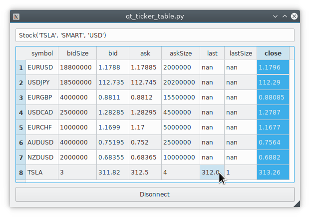

.. _recipes:

Code recipes
============

Collection of useful patterns, snippets and recipes.

When using the recipes in a notebook, don't forget to use ``util.startLoop()``.

Fetching consecutive historical data
^^^^^^^^^^^^^^^^^^^^^^^^^^^^^^^^^^^^

Suppose we want to get the 1 min bar data of Tesla since the very beginning
up until now. The best way is to start with now and keep requesting further
and further back in time until there is no more data returned.

.. code-block:: python

    import datetime
    from ib_insync import *

    ib = IB()
    ib.connect('127.0.0.1', 7497, clientId=1)

    contract = Stock('TSLA', 'SMART', 'USD')

    dt = ''
    barsList = []
    while True:
        bars = ib.reqHistoricalData(
            contract,
            endDateTime=dt,
            durationStr='10 D',
            barSizeSetting='1 min',
            whatToShow='MIDPOINT',
            useRTH=True,
            formatDate=1)
        if not bars:
            break
        barsList.append(bars)
        dt = bars[0].date
        print(dt)

    # save to CSV file
    allBars = [b for bars in reversed(barsList) for b in bars]
    df = util.df(allBars)
    df.to_csv(contract.symbol + '.csv', index=False)

Scanner data (blocking)
^^^^^^^^^^^^^^^^^^^^^^^

.. code-block:: python

    allParams = ib.reqScannerParameters()
    print(allParams)

    sub = ScannerSubscription(
        instrument='FUT.US',
        locationCode='FUT.GLOBEX',
        scanCode='TOP_PERC_GAIN')
    scanData = ib.reqScannerData(sub)
    print(scanData)

Scanner data (streaming)
^^^^^^^^^^^^^^^^^^^^^^^^

.. code-block:: python

    def onScanData(scanData):
        print(scanData[0])
        print(len(scanData))

    sub = ScannerSubscription(
        instrument='FUT.US',
        locationCode='FUT.GLOBEX',
        scanCode='TOP_PERC_GAIN')
    scanData = ib.reqScannerSubscription(sub)
    scanData.updateEvent += onScanData
    ib.sleep(60)
    ib.cancelScannerSubscription(scanData)

Option calculations
^^^^^^^^^^^^^^^^^^^

.. code-block:: python

    option = Option('EOE', '20171215', 490, 'P', 'FTA', multiplier=100)

    calc = ib.calculateImpliedVolatility(
        option, optionPrice=6.1, underPrice=525)
    print(calc)

    calc = ib.calculateOptionPrice(
        option, volatility=0.14, underPrice=525)
    print(calc)

Order book
^^^^^^^^^^

.. code-block:: python

    eurusd = Forex('EURUSD')
    ticker = ib.reqMktDepth(eurusd)
    while ib.sleep(5):
        print(
            [d.price for d in ticker.domBids],
            [d.price for d in ticker.domAsks])

Minimum price increments
^^^^^^^^^^^^^^^^^^^^^^^^

.. code-block:: python

        usdjpy = Forex('USDJPY')
        cd = ib.reqContractDetails(usdjpy)[0]
        print(cd.marketRuleIds)

        rules = [
            ib.reqMarketRule(ruleId)
            for ruleId in cd.marketRuleIds.split(',')]
        print(rules)

News articles
^^^^^^^^^^^^^

.. code-block:: python

    newsProviders = ib.reqNewsProviders()
    print(newsProviders)
    codes = '+'.join(np.code for np in newsProviders)

    amd = Stock('AMD', 'SMART', 'USD')
    ib.qualifyContracts(amd)
    headlines = ib.reqHistoricalNews(amd.conId, codes, '', '', 10)
    latest = headlines[0]
    print(latest)
    article = ib.reqNewsArticle(latest.providerCode, latest.articleId)
    print(article)

News bulletins
^^^^^^^^^^^^^^

.. code-block:: python

    ib.reqNewsBulletins(True)
    ib.sleep(5)
    print(ib.newsBulletins())

Dividends
^^^^^^^^^

.. code-block:: python

    contract = Stock('INTC', 'SMART', 'USD')
    ticker = ib.reqMktData(contract, '456')
    ib.sleep(2)
    print(ticker.dividends)

Output::

    Dividends(past12Months=1.2, next12Months=1.2, nextDate=datetime.date(2019, 2, 6), nextAmount=0.3)

Fundemental ratios
^^^^^^^^^^^^^^^^^^

.. code-block:: python

    contract = Stock('IBM', 'SMART', 'USD')
    ticker = ib.reqMktData(contract, '258')
    ib.sleep(2)
    print(ticker.fundamentalRatios)

Async streaming ticks
^^^^^^^^^^^^^^^^^^^^^

.. code-block:: python

    import asyncio

    import ib_insync as ibi

    class App:

        async def run(self):
            self.ib = ibi.IB()
            with await self.ib.connectAsync():
                contracts = [
                    ibi.Stock(symbol, 'SMART', 'USD')
                    for symbol in ['AAPL', 'TSLA', 'AMD', 'INTC']]
                for contract in contracts:
                    self.ib.reqMktData(contract)

                async for tickers in self.ib.pendingTickersEvent:
                    for ticker in tickers:
                        print(ticker)

        def stop(self):
            self.ib.disconnect()

    app = App()
    try:
        asyncio.run(app.run())
    except (KeyboardInterrupt, SystemExit):
        app.stop()

Integration with PyQt5 or PySide2
^^^^^^^^^^^^^^^^^^^^^^^^^^^^^^^^^

`This example <https://github.com/erdewit/ib_insync/blob/master/examples/qt_ticker_table.py>`_
of a ticker table shows how to integrate both
realtime streaming and synchronous API requests in a single-threaded
Qt application.
The API requests in this example are ``connect`` and
``ib.qualifyContracts()``; The latter is used
to get the conId of a contract and use that as a unique key.

The Qt interface will not freeze when a request is ongoing and it is even
possible to have multiple outstanding requests at the same time.

This example depends on PyQt5:

``pip3 install -U PyQt5``.

It's also possible to use PySide2 instead; To do so uncomment the PySide2
import and ``util.useQt`` lines in the example and comment out their PyQt5
counterparts.

Integration with Tkinter
^^^^^^^^^^^^^^^^^^^^^^^^

To integrate with the Tkinter event loop, take a look at
`this example app <https://github.com/erdewit/ib_insync/blob/master/examples/tk.py>`_.

Integration with PyGame
^^^^^^^^^^^^^^^^^^^^^^^

By calling ``ib.sleep`` from within the PyGame run loop, ib_insync can periodically
run for short whiles and keep up to date:

.. code-block:: python

    import ib_insync as ibi
    import pygame

    def onTicker(ticker):
        screen.fill(bg_color)
        text = f'bid: {ticker.bid}   ask: {ticker.ask}'
        quote = font.render(text, True, fg_color)
        screen.blit(quote, (40, 40))
        pygame.display.flip()

    pygame.init()
    screen = pygame.display.set_mode((800, 600))
    font = pygame.font.SysFont('arial', 48)
    bg_color = (255, 255, 255)
    fg_color = (0, 0, 0)

    ib = ibi.IB()
    ib.connect()
    contract = ibi.Forex('EURUSD')
    ticker = ib.reqMktData(contract)
    ticker.updateEvent += onTicker

    running = True
    while running:
        # This updates IB-insync:
        ib.sleep(0.03)

        # This updates PyGame:
        for event in pygame.event.get():
            if event.type == pygame.QUIT:
                running = False
                pygame.quit()
